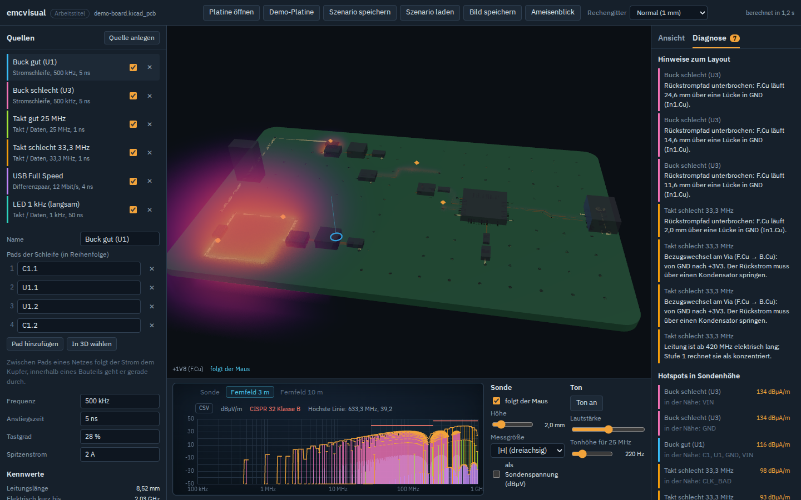

# emcvisual

> Arbeitstitel. Der Name steht nur in `branding.config.json` und lässt sich mit einem Skript
> ändern, siehe [docs/RENAMING.md](docs/RENAMING.md).

**Im Browser ausprobieren / try it:** https://tombueng.github.io/emcvisual/

**In English:** a browser tool that computes the quasi-static magnetic near field of a KiCad
board and turns it into a 3D world you can look at and listen to: glowing field volumes,
field lines, a virtual near-field probe with a spectrum-analyzer view, a far-field estimate
against CISPR 32 and layout hints (return paths over plane gaps, reference changes at vias).
Return currents detour around plane slots and jump through stitching vias or capacitors, the
electric field can be shown as well, a full-wave openEMS run can be exported, computed locally and
loaded as a second field source, and a near-field scanner (a 3D printer moving a probe,
tinySA as receiver; a virtual rig for trying it without hardware) compares measurements with
the simulation. The interface speaks German and English; the docs are in German.

Elektromagnetische Felder einer Leiterplatte kann man nicht sehen. Dieses Werkzeug rechnet
sie aus einer KiCad-Platine aus und macht daraus eine **begehbare 3D-Welt mit Bild und Ton**:
Wo leuchtet es, wo brummt es, und was passiert, wenn die Flanke langsamer wird oder der
Eingangskondensator näher an den Schaltregler rückt?

Alles läuft im Browser. Die Platinendatei verlässt den Rechner nicht.



## Stand

**Stufe 1 (M0–M6) läuft:** quasistatische Simulation des magnetischen Nahfelds
(Biot-Savart mit Spiegelströmen in den Bezugsflächen) und dazu:

- KiCad 6 bis 10 importieren; Bezugsflächen werden erkannt, Quellen aus Netznamen vorgeschlagen
- Quellen: Takt- und Datenleitungen (auch über Serienwiderstände), Differenzpaare,
  Stromschleifen von Schaltreglern (Pads auch per Klick in 3D)
- Feld als leuchtendes Volumen, Schnittebene, Feldlinien der gewählten Quelle, Ameisenblick
- virtuelle Nahfeldsonde mit Spektrumanalysator, Fernfeld-Abschätzung gegen CISPR 32 B
- Klang: jede Quelle klingt, laut wo das Feld stark ist
- Diagnose: unterbrochene Rückstrompfade, Bezugswechsel an Vias, fehlende Stitching-Vias,
  Hotspots mit den Netzen und Bauteilen in der Nähe
- echte 3D-Bauteilmodelle aus KiCads GLB-Export (`.glb` zusätzlich auf das Fenster ziehen)
- Szenario als JSON speichern, PNG- und CSV-Export, EMV-Bericht als HTML (druckbar als PDF)
- Oberfläche auf Deutsch und Englisch (Auswahl oben rechts, Standard nach Browsersprache)

Plan, Abnahmekriterien und Umsetzungsnotizen: [docs/stufe-1/PLAN.md](docs/stufe-1/PLAN.md).

**Stufe 2 (in Arbeit):** Rückströme laufen um Schlitze in der Fläche herum und springen bei
einem Lagenwechsel über die nächste Stitching-Via oder den nächsten Kondensator (Umwege werden
in 3D gezeigt); elektrisches Feld aus Leitungs- und Knotenladungen; Streufeld offener und
geschirmter Speicherdrosseln. Details: [docs/zukunft/STUFE-2-FLAECHENSTROEME.md](docs/zukunft/STUFE-2-FLAECHENSTROEME.md).

**Stufe 3 (in Arbeit):** Vollwelle mit openEMS. Die App exportiert einen Job,
`tools/openems/run_job.py` rechnet ihn lokal, und das Ergebnis lässt sich als zweite Feldquelle
neben das schnelle Modell legen: Volumen, Sonde, Scan und Fernfeld. Im quasistatischen Bereich
stimmen beide auf etwa 1 dB überein. Details: [tools/openems/README.md](tools/openems/README.md),
[docs/zukunft/STUFE-3-VOLLWELLE.md](docs/zukunft/STUFE-3-VOLLWELLE.md).

**Feldcheck für die CI:** dieselbe Rechnung als Node-Skript. Es meldet je Quelle Nahfeld,
Fernfeld-Abstand und Layout-Hinweise und schlägt an, wenn ein Pull Request etwas verschlechtert.
Das Skript liegt unter https://tombueng.github.io/emcvisual/cli/field-check.mjs, Anleitung in
[docs/CI-FELDCHECK.md](docs/CI-FELDCHECK.md).

**Stufe 4 (in Arbeit):** Reiter „Messung“: Ein 3D-Drucker fährt eine Nahfeldsonde über die
Platine, ein Empfänger misst je Punkt ein Spektrum, das Ergebnis erscheint als Schnitt in
Messhöhe und als Differenz zur Simulation. Ein virtueller Prüfstand misst die Simulation und
zeigt die ganze Kette ohne Hardware; die Treiber für OctoPrint, G-Code über USB und den tinySA
sind geschrieben, aber noch an keinem Gerät erprobt. Details:
[docs/zukunft/STUFE-4-MESSUNG-SCANNER.md](docs/zukunft/STUFE-4-MESSUNG-SCANNER.md).

Was später kommt (Flächenlöser, Phase und Wellen, Handsonde, VR):
[docs/ROADMAP.md](docs/ROADMAP.md).

## Loslegen

```bash
npm install
npm run dev
```

Dann im Browser „Demo-Platine“ wählen oder eine eigene `.kicad_pcb` (KiCad 6 bis 10) auf das
Fenster ziehen. In Chrome und Edge folgt die App der geöffneten Datei: Jedes Speichern in KiCad
lädt die Platine neu, Quellen und Ansicht bleiben (Abzeichen „live“ neben dem Dateinamen).

Echte Bauteilmodelle: in KiCad „Datei → Exportieren → glTF/GLB“ (ohne Platinenkörper) oder
`kicad-cli pcb export glb --no-board-body --subst-models board.kicad_pcb`, dann die `.glb`
zusätzlich auf das Fenster ziehen. Die Bauteile werden über ihre Referenz zugeordnet.

Platinen lassen sich auch per Link öffnen: `?demo` lädt die Demo, `?board=<URL>` eine
`.kicad_pcb` von einem Server, der fremde Seiten lesen lässt (z. B. `raw.githubusercontent.com`),
optional mit `&models=<URL>` für das GLB.
Beispiel: [Glasgow revC3](https://tombueng.github.io/emcvisual/?board=https://raw.githubusercontent.com/GlasgowEmbedded/glasgow/HEAD/hardware/boards/glasgow/revC3/glasgow.kicad_pcb).

| Befehl | Zweck |
|---|---|
| `npm run dev` | Entwicklungsserver |
| `npm test` | Tests (Physik gegen analytische Lösungen, Parser gegen pcbnew-Referenzdaten) |
| `npm run e2e` | Playwright-Tests im Browser (vorher einmal `npx playwright install --only-shell chromium`) |
| `npm run check` | Typprüfung (TypeScript + Svelte) |
| `npm run build` | statische Seite nach `dist/`, dazu der Feldcheck nach `dist/cli/` |
| `npm run field-check -- board.kicad_pcb --scenario s.json` | Feldcheck ohne Browser, z. B. in der CI ([docs/CI-FELDCHECK.md](docs/CI-FELDCHECK.md)) |
| `npm run demo-board` | Demo-Platine mit KiCad (pcbnew-Python) neu erzeugen |
| `npm run check:codename` | prüft, dass der Arbeitstitel nur an erlaubten Stellen steht |

## Was die Simulation kann und was nicht

Sie zeigt zuverlässig, **wo** Stromschleifen Felder erzeugen und wie sich Änderungen auswirken
(Schleifenfläche, Rückstrompfad, Flankensteilheit). Sie sagt **nicht** voraus, ob ein Gerät
eine EMV-Prüfung besteht: keine Resonanzen, keine Kabel, kein Gehäuse. Die Annahmen und
Grenzen stehen in [docs/stufe-1/PHYSIK.md](docs/stufe-1/PHYSIK.md).

## Dokumentation

- [docs/ROADMAP.md](docs/ROADMAP.md): Stufen und Abhängigkeiten
- [docs/stufe-1/PLAN.md](docs/stufe-1/PLAN.md): Ziele, Meilensteine, Abnahmekriterien
- [docs/stufe-1/PHYSIK.md](docs/stufe-1/PHYSIK.md): Modell, Formeln, Gültigkeit, Literatur
- [docs/stufe-1/ARCHITEKTUR.md](docs/stufe-1/ARCHITEKTUR.md): Aufbau der App
- [docs/ENTSCHEIDUNGEN.md](docs/ENTSCHEIDUNGEN.md): Entscheidungen mit Begründung
- [docs/zukunft/](docs/zukunft/): Stufen 2 bis 5 und Querschnittsthemen

## Lizenz

Noch nicht festgelegt.
